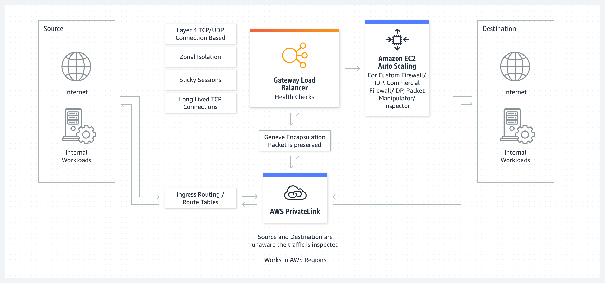

# AWS

## Services

### IAM

IAM (identity and access management) delegates AWS permissions to *users*, *groups*, and *roles*.

IAM allows you to generate and download reports that list users, and the status of their credentials (such as passwords, access keys, and MFA devices).

It is a global service, and is not region/AZ-specific.

#### Principals

IAM principals include users, roles, and the root user.

#### Entities

IAM entities include users and roles.

#### Identities

IAM identities include users, roles, and groups.

#### Users

IAM users represent individuals. Individuals can be assigned to zero-to-many groups. They have their own credentials, independent from root account credentials.

#### Groups

Groups are collections of IAM users. Groups cannot contain nested groups.

#### Roles

IAM roles are like *temporary* IAM users. Roles are assumable by whoever needs them. They do not have passwords or access keys like users do. Roles are associated with short-term sessons and have temporary security credentials.

Roles are used for:

1. Federated user access (in the event that you have an external identity provider)
2. Temporary IAM user permissions
3. Cross-account access (i.e. to delegate privileges to users defined in other AWS accounts)
4. Cross-service access (three types: "forward access sessions", "service roles", and "service-linked roles")
5. EC2 instances (these also use IAM instance profiles)

Roles have two policies:

1. A *permissions policy*, which grants the user of the role the permissions to perform a task
2. A *trust policy*, which specifies which account members can assume a role

A *trust policy* is a JSON/resource-based policy attached to an IAM role that specifies users, roles, accounts, and services.

##### Cross-account Roles

AWS allows for resources in one account being shared with users in a different account through cross-account roles. This is so users don't have to have two different user accounts (one per AWS account) and they don't have to log in twice. This is NOT an AWS best-practice. AWS recommends to use federation with an IdP instead, delegating access through temporary credentials instead of long-term IAM users.

To do this, you set up a role in the *destination* account, defining the *origin* account as a "trusting entity", and defining a permissions policy for a given resource in the destination account. Then you have a user switch roles to test the new access.

##### Service-linked Roles

A service-linked role is a role associated with, and assigned to, an atomic AWS service. This is similar to how permissions are delegated to IAM users, but service-linked roles are assigned to (and owned by) AWS services themselves.

#### Policies

Policies are attached to IAM identities (i.e. users, groups, roles), defining their permissions. 

Policy statements are JSON documents that include a *version* and a *statement*. The *statement* is a list of (a) effects, (b) actions, (c) resources, and (d) optional conditions.

Policy types include:

| Policy Type               | Description                                         |
| -----------               | --------------------------------------------------- |
| `Identity-based policies` | Managed or inline policies attached to IAM identities. |
| `Resource-based policies` | Associated with services (i.e. resources); for example: S3 bucket policies. They don't have to be in the same account. |
| `Permissions boundaries`  | Managed policies that define the *maximum* permissions that identity-based policies can grant to entities. They do not grant permissions. |
| `Organizations SCPs`      | AWS Organizations concept which defines maximum permissions for organizational units. They do not grant permissions. |
| `ACLs`                    | Define which principals in cross-accounts can access ACL-bounded resources. They are like resource-based policies, but do not use JSON. |
| `Session policies`        | Used in tandem with the AWS CLI/API to assume specific roles, thereby limiting the persmissions that are granted to the session. |

### IAM Identity Center

IAM Identity Center is an SSO solution that wraps over IAM. It is a free service.

### S3

S3 is an object storage service.

Prior to 2020, S3 was "*eventually consistent*" - meaning a `PUT` call would not be immediately visible to `GET` or `LIST` requests. It is now [*strongly consistent*](https://aws.amazon.com/blogs/aws/amazon-s3-update-strong-read-after-write-consistency/).

#### Storage Tiers

S3 bills you for stored objects, depending on their access rates and retrieval speed.

##### AWS S3 Standard

* Used for frequently-accessed data
* Low latency; high throughput
* 99.99% availability

S3 Standard replicates data across several availability zones in a region.

##### AWS S3 Intelligent-Tiering

* Used when access frequency is unknown
* Automatically moves data to most cost-effective access tiers, based on access frequency
* 99.9% availability

##### AWS S3 Express One Zone

* Faster than S3 Standard, but limited to a specific availability zone
* 99.95% availability

##### AWS S3 Standard-Infrequent Access (Standard-IA)

* Used when data is accessed less frequently, but requires rapid retrival
* Single-AZ
* 99.5% availability

##### AWS S3 Glacier

* Lowest-cost storage option
* Has three storage retrieval classes: Instant Retrieval (milliseconds), Flexible Retrieval (minutes-to-hours), and Deep Archive (hours).

Glacier may have a "vault lock policy" attached to it, which is an immutable policy.

#### Replication

Objects can be replicated across regions, or into the same regions.

Cross-region replication requires that you enable versioning on the bucket. It also requires an IAM policy to allow S3 to replicate objects on your behalf.

#### Server Access Logging

You can enable logging to derive the following bucket specific information: the bucket owner, the bucket, the action time, the IP address (or requester and request ID), the type of operation, the S3 bucket key, HTTP response status, etc.

### Serverless Application Model (SAM)

Serverless Application Model is an IaC template, with a corresponding CLI, which generates CloudFormation templates for Lambda functions.

### Serverless Application Repository

Serverless Application Repository is a managed repository for serverless applications. They are pre-built applications with SAM templates that defines the AWS resources used.

### ELB

[Elastic Load Balancers](https://aws.amazon.com/elasticloadbalancing/) distribute network traffic across targets/applications in one or more AZs.

They consist of application, gateway, network, and classic load balancers.

Load balancers accept incoming traffic from clients and route the traffic to registered targets in availability zones. They also monitor health of the registered targets. 

Load balancers use "listeners", wich are processes that check for connection requests, with configurations including protocols and port numbers.

Load balancers are isolated to particular availability zones. Application load balancers require a minimum of two targets in separate availability zones.

#### ALB (Application Load Balancers)

Application load balancers operate at OSI Layer 7 (HTTP/HTTPS).

#### GLB (Gateway Load Balancers)

Gateway load balancers deploy/scale/manage things like firewalls, intrusion detection and prevention systems, and packet inspection systems. They operate at OSI Layer 3 (the network layer).

#### NLB (Network Load Balancers)

Network load balancers operate at OSI Layer 4 (TCP/UDP).

#### CLB (Classic Load Balancers)

Classic load balancers operate at OSI Layer 4 and 7 (TCP/SSL/HTTP/HTTPS).

#### SSL Cipher Suites, SSL Protocols, and Server Order Preference

Clients and load balancers negotiate SSL protocols, and SSL cipher suites as part of the SSL specification. 

Server Order Preference is optionally supported. In "Server Order Preference", the client and the load balancer both communicate to each other which ciphers and protocols they support - ranked in order of preference - and choose which ones they want to use based off of that.

### VPC

VPC is a "virtual private cloud".

You can have up to five VPCs in a region by-default.

#### Internet Gateways

An internet gateway is a horizontally scaled VPC component that allows resources in public subnets of the VPC to communicate back-and-forth with the internet over IPv4 and IPv6, provided they have a public IP address.

Internet Gateways are targeted by VPC route tables to route traffic out to the internet. Internet gateways perform network address translation (NAT).

#### Elastic Network Interfaces

Elastic network interfaces are virtual network cards for VPCs. These are attached to EC2 instances launched in a particular availability zone. Each has a private IP address associated with the subnet that it sits in. They cannot be moved across subnets. They can be attached or unattached from EC2 instances freely.

If multiple network interfaces are attached to an instance (in different subnets or different VPCs), the instance is said to be "dual-homed".

#### Security groups

The default security group for a VPC allows all outbound traffic, restricts all inbound traffic, and allows instances within the security group to communicate with each other.

#### VPC Endpoints

A VPC endpoint is used to privately connect to specific AWS services. This is integrated with AWS PrivateLink. The traffic in these cases never leaves the AWS network.

There are two types of VPC endpoints: *interface endpoints* and *gateway endpoints*.

##### Interface endpoints

Interface endpoints are related to AWS PrivateLink. It is a collection of elastic network interfaces with a private IP address that serves as an entry point for traffic destined to a supported service.

##### Gateway endpoints

Gateway endpoints target specific IP routes in an Amazon VPC route table. These are used by DynamoDB and S3. Gateway endpoints are unrelated to AWS PrivateLink.

##### Network ACLs

A network access control list is an optional feature that allows you to specify firewall rules for subnets. This is similar to security groups, but more granular. There is no charge for their usage.

NACLs are stateless, meaning information about previously sent/received traffic is not saved. Security groups are stateful. For instance: an EC2 instance with inbound traffic allowed is allowed to communicate outbound responses with the message sender.

##### Subnets

Subnets (sub-networks) are ranges of IP addresses allocated within a VPC.

A subnet is **private** if it is not attached to an internet gateway. They need NAT devices to access the internet.

A subnet is **public** if it is connected to an internet gateway.

Subnets can communicate with each other by-default in an AWS VPC with default settings.

#### Routes

Routes are rules (kind of like security groups) that define how subnet/gateway traffic is directed. 

#### NAT Devices

Network Address Translation (NAT) devices allow resources in private subnets to communicate with the internet (or other VPCs, or on-premise networks). They cannot receive unsolicited requests.

A NAT *gateway* can be public or private. If it is public, it allows for outbound internet traffic.  If it is private, it allows for outbound intra-VPC/on-prem traffic. NAT gateways have to be situated in subnets that are distinct from the instances that use them, because NAT gateways route to internet gateways, and instances route to NAT gateways - the operative term being *route*, which defines relationships between subnets/gateways.

A NAT *instance* sits in a public subnet, and allows instances in private subnets to perform outbound internet traffic, by way of the NAT instance, to an Internet Gateway that allows for public internet access. These are end-of-life in favor of NAT gateways.

You seat NAT instances inside VPCs, configure a security group for it, create a NAT AMI, and then create a NAT instance. The NAT instance must have source/destination checks disabled on itself. The NAT instance also its inside of a private subnet, which in turn contains a route table, which in turn contains routes that need to be updated such that NAT instance may communicate with outside resources (such as the Internet).

#### Transit Gateway

Transit Gateways are used to connect VPCs with on-premise networks. Routes can be automatically propagated to transit gateway route tables.

### EC2

EC2 (or "elastic compute cloud") are virtual machines in AWS.

The default maximum capacity of EC2 instances per-region is 20. 

Private IP addresses for EC2 instances fall between 10.0.0.0 and 10.255.255.255, 172.16.0.0 and 172.31.255.255, and 192.168.0.0 and 192.168.255.255.

#### Auto Scaling

An Auto Scaling Group (ASG) is a collection of EC2 instances that are grouped together for automatic scaling.  You can implement health-check based replacements of instances.

The "desired capacity" determines the amount of instances you want to host by-default. Desired capacity is distributed evenly among availability zones.

Scaling policies modulate instance count between the "minimum" and "maximum" capacity.  The ASG can (1) maintain current levels, (2) be manually scaled up and down, (3) be scheduled to scale up and down, or (3) dynamically change capacity based on traffic changes.

ASGs support both on-demand and spot instances.

ASGs leverage *launch templates*, whichspecify instance configuration, including AMIs, instance types, key pairs, security groups, etc. Launch templates are versioned.

You can set policies such as step scaling, and simple scaling. Scaling policies are invoked by breaching CloudWatch alarms. Simple and step scaling are almost identical, but step scaling is preferred by AWS.

#### Spot Instances

A *spot instance* uses spare data center EC2 capacity, and costs less than a typical on-demand instance. 

  * *Spot prices* are set by AWS.
  * *Spot capacity pools* are sets of spot instances with a given instance type, in a specific availabilty zone.
  * *Spot instance requests* are requests to AWS to fulfill EC2 demand when capacity is available. It can be a one-time thing, or continual (persistent). Persistent spot instance requests are filed automatically on-instance-interruption.
  * During a *spot instance interruption*, AWS terminates/stops/hibernates the given spot instance, giving you a two minute warning.
  * AWS lets you know when spot instances are at high risk of interruption via *EC2 instance rebalance recommendations*.

#### Elastic Block Store

EBS, or "elastic block store", are block-storage resources that are used with EC2 instances. They can be volumes or snapshots. 

Once created, you cannot modify the resting encryption status.

#### Pricing

* On-demand instances are billed by the hour depending on their instance class. You pay full price for an on-demand instance.
* Spot instances are offered at a (up to) 90% discount. These are "spare" EC2 instances that can be evicted at any time. The use-case is highly niche - stuff like data analysis, batch jobs, background processing, and optional tasks. 
* Under the "savings plan" model, the end-user commits to a certain amount of hourly usage over the course of 1 (or 3) years. This is very similar to the "reserved instance" model, but intended to be a bit more flexible.
* Reserved instances offer a (up to) 72% discount, but you lease the server per-instance-class for 1-3 years. RIs are tied to particular accounts, but note that AWS Organizations has a "consolidated billing" feature that lets you use RI leases across accounts (kinda cool!); the accounts are treated as one for the purposes of billing.

#### UserData

EC2 instances, on-launch, have the option of passing "user data" to the instance, performing automated configuration tasks. They take the form of either (a) shell scripts or (b) cloud-init directives. 

To see user data, view EC2 → Actions → Instance settings → Edit user data.

Userdata only gets invoked at launch time. On CFN update, it does not get invoked.

#### Placement Groups

EC2 placement groups can be used when EC2 instances are highly interdependent. They are *free* and *optional*.  They come in three flavors:

1. *Cluster placement groups*, which pack instances close together in the same availability zone: lowering network latency. This can be used for HPC applications.
2. *Spread placement groups*, which spread instances across distinct underlying hardware to reduce correlated failures. 
3. *Partition placement groups*, which partition instances across an availability zone so that they maintain unique underlying hardware, with unique networks and power sources. This can be used for larger distributed workloads (i.e. Hadoop, Cassandra, and Kafka).

Note that dedicated instances are segregated in such a way that they do not share hosts with any other AWS customer.

#### Instance Store

EC2 Instance Store Temporary Block Storage is a feature that allows an EC2 instance to attach to an ephemeral block storage volume. The use case is if you need a temporary cache/buffer for an instance. 

The data is persisted on instance reboot, and deleted on instance stop/hibernate/termination.

Instance stores are *free*.

#### Elastic IP Addresses

Elastic IP addresses are IP addresses that are accessible from the public internet, and that map to either EC2 instances or network interfaces.

#### Enhanced Networking

"Enhanced networking" is a special type of virtualization feature for EC2 that allows for higher bandwidth, higher packet-per-second performance, lower latency between instances, and less jitter.  It's free, but `t2` instances don't support it.

### ECS

Elastic Container Service (ECS) is a container orchestration service used to run containers.

A single task definition can describe up to 10 containers to launch at a time. 

### RDS 

RDS (or "relational database service") are databases in AWS.

#### Multi-AZ deployments

If "multi-AZ" is configured for an instance, either one or two "standby" database instances are created.

If *one* instance is created, it provides failover support but it does not serve read traffic. This is called a "multi-AZ instance". A multi-AZ instance has one write instance and one read replica.

If *two* instances are created, it provides failover support, **and** it serves read traffic. This is called a "multi-AZ cluster". A multi-AZ cluster has one write instance and two read replicas.  

In the event of failover, the traffic is routed to a read replica automatically.

Microsoft SQL Server and Oracle RDS instances do not support read replicas.

### CloudWatch

CloudWatch is a monitoring service that has alarms and dashboards.

CloudWatch can alarm on logfile content by way of *metric filters*, which define patterns upon which to scan incoming CloudWatch Logs data, and turn those patterns into CloudWatch metrics. It does not retroactively perform this type of filtering.

CloudWatch is also a log storage solution. It can access logs from EC2 instances, CloudTrail, Route 53, etc. CloudWatch logs are *standard class* or *infrequent access class*. Logs can be queried and indexed. It ships with a service called Live Tail to troubleshoot in real time. Sensitive data can be masked. DNS queries can be logged. 

Logs can be *manually* exported to S3 buckets that are SSE-KMS (server-side encryption with key management service) encrypted, or have S3 Object Lock enabled with a given duration period. However, this is not recommended - and AWS suggests using *subscription filters* instead. Log data can be shipped to AWS Kinesis streams, Data Firehose streams, and/or Lambda functions, via *subscription filters*. It takes about three minutes for those logs to matriculate in.

CloudWatch Events are a real-time stream of system events that occur when AWS resources change. They can respond to those events by sending messages, activating functions, making changes, and capturing state information.

### Cloud9

Cloud9 is a deprecated in-browser IDE.

### CloudShell

CloudShell is a browser-based shell that allows you to run AWS CLI scripts.

### EMR (Elastic Map Reduce)

EMR is a managed Hadoop framework. Hadoop is an Apache tool that does "MapReduce"-based analysis on big data, which is used to do parallelized data analysis.

#### Apache Hive on Amazon EMR

Apache Hive is a petabyte-scale data warehousing tool. It is open-source, distributed, and fault-tolerant. It is natively supported in AWS EMR.

### X-Ray

X-Ray is a data collection, visualization, and analysis service. It tries to find areas of optimization for a given application, using "trace data" that it receives from it.

Some services are integrated with X-Ray and can send tracing headers automatically. For example, Lambda can send data to X-Ray.

Clients can also leverage the X-Ray SDK to send JSON documents to a local X-ray daemon, which batch-uploads the data to X-Ray over UDP.

X-Ray uses the data to generate "trace maps", which display various client/service data to help find bottlenecks, latency spikes, etc.

### Elastic Beanstalk

Elastic Beanstalk is a service that deploys web applications and groups of web application-related services automatically.

EBS supports multiple "deployment strategies":

 * *All-at-once*: Deploys in-place to all instances.
 * *Rolling*: Splits EC2 instances into batches, and deploys to one batch at a time. During a batch, EBS detaches all EC2 instances from the load balancer, deploys the new application version to them, and then reattaches those instances. It moves through the batches until all instances report successful health checks.
 * *Rolling with additional batch*: Creates a batch of EC2 instances, then splits instances into batches, and deploys to each batch at a time. This is used specifically when you need to maintain full capacity during a deployment. It is otherwise identical to rolling deployments.
 * *Immutable*: Deploys to new instances altogether, and tears down the old ASG/instances at the end. This is to ensure overall stability and safety.
 * *Traffic splitting*: Identical to an immutable deployment, but forwards some percentage of traffic to new instances over time, and then shuts down the old instances. This is to enable "canary-like" deployments.

### Athena

Athena does SQL queries against S3 buckets. It analyzes CSV, JSON, or columnar data. It integrates with QuickSight to visualize data. It generates reports.

### AppSync

AppSync is a service that generates GraphQL endpoints for applications. 

AppSync can subscribe to applications to implement  real-time updates. Clients invoke the subscription operations, which creates a WebSocket connection, which is maintained by AppSync. In this way, applications can distribute data in real-time.

It has integrations with DynamoDB.

### AppFlow

AppFlow is an integration service that transfers SaaS data between Salesforce, SAP, Google Analytics, Facebook Ads, ServiceNow, AWS S3, and AWS Redshift.

### AppConfig

AppConfig is an SSM feature that is a "managed feature flag" kind of service. You manage your configuration in AWS (as an AppConfig artifact), create an "application namespace", define "environments" (like containers, Lambda functions, etc.), create a "configuration profile", deploy configuration data, and retrieve configurations with a local AppConfig agent.

### Copilot

Copilot is a CLI intended to bootstrap ECS, Fargate, and App Runner projects. 

### CodeWhisperer

CodeWhisperer is an ML-based code generation tool. It also scans for security issues. It integrates with the command line, VSCode, JetBrains, etc. It is being semi-deprecated (i.e. integrated with Amazon Q Developer).

### ElastiCache

ElastiCache is a managed Redis/Memcached service.

Redis-based ElastiCache instances only contain a single node. Memcached-based ElastiCache instances support up to 20 nodes by-default.

#### Caching Strategies

*Lazy loading* is a strategy in which one caches data *only when necessary*. An application calls a cache - then if it doesn't find the data there (e.g. a "cache miss"), it loads it from somewhere else, and then populates the cache. Later, it will call the cache and likely perform a "cache hit". Note that (a) cache misses are expensive, and (b) cached data can become stale if you only write data to the cache on-cache-miss. 

*Write-through* is a strategy in which the data in the cache is updated whenever data is written to the database. Note that (a) new cache nodes will not contain historical data, and (b) most data is never read from the cache.

*Time-to-live* is a value you can add to cached data to explain when data goes stale, to ensure that the data is relatively up-to-date. 

### DynamoDB

DynamoDB is a schemaless, serverless NoSQL database service. It scales without incurring downtime. It is fully-managed, and you don't have to patch it. A potential use-case for DynamoDB is for session storage.

DynamoDB stores data as groups of *items* (i.e. "attributes" or "rows"), across *partitions* which are replicated across AZs within a region. A partition is an up-to-10GB storage unit.

DynamoDB does not support JOIN operators, and prefers denormalized schemas.

DynamoDB Streams track item-level modifications in DynamoDB tables for up to 24 hours, and log them. Lambda can trigger in response to a DynamoDB event.

DynamoDB will throttle requests beyond provisioned RCU (read capacity unit)s and/or WCU (write capacity unit)s for the database. This can be due to poor partition key choices.

#### DynamoDB Accelerator (DAX)

DynamoDB Accelerator ia a DynamoDB caching service that provides microsecond-level performance (compared to native DynamoDB millisecond performance). It is designed for eventually consistent data. It supports server-side encryption-at-rest and encryption-in-transit via TLS/x509.

It is designed for applications such as:

 * Real-time bidding, gaming, and trading applications
 * Applications that read some items more frequently than others (DynamoDB by contrast can have "hot" partitions)
 * Read-intensive and cost-sensitive applications
 * Applications that require repeated reads against big data sets

It is not designed for:

 * Applications requiring strongly-consistent reads
 * Applications that don't need microsecond response times
 * Write-intensive applications
 * Applications without many repeated reads

#### Keys

DynamoDB primary keys require a *partition key*, and may include an optional *sort key*. The primary key should be chosen to maximize uniformity. In general, DynamoDB is optimized to query against a particular primary key. Data is grouped according to the partition key. The *sort key* determines the order of data being stored along the lines of the partition key.

Partition keys are supplied to internal hash functions as inputs. The hash functions determine the partition where the item/row is stored. If a collection of items exceeds 10GB, the *sort key* is then used to split partitions.

#### Indices

Primary indices are (probably) determined by the primary key. You can define secondary indices as well - either *global* or *local* - which are specific to a table.

  * A *global secondary index* is an index with a composite key (a partition key coupled with a sort key). It is called a "global" index because queries against the index span all partitions.
  * A *local secondary index* is an index with the same partition key as its base table, but which uses a different sort key.

#### API 

Some basic API operations include:

| Operation      | Description                                         |
| -----------    | --------------------------------------------------- |
| `GetItem`      | Retrieves a single table item.                      |
| `BatchGetItem` | Retrieves up to 100 items.                          |
| `Query`        | Retrieves all items with a specified partion key.   |
| `Scan`         | Retrieve all items in the specified table or index. |

### Personal Health Dashboard

Personal Health Dashboard is a global service health/status dashboard. It's used when AWS is experiencing outages and/or service degradations.

### Trusted Advisor

Trusted Advisor offers recommendations related to cost optimization, performance, security, fault tolerance, service limits, and operational excellence. It's sort of like a best-practices guide.

Trusted Advisor can emit events to EventBridge - for example, to call a Lambda function when an account reaches a particular type of service limit. 

### Inspector

Inspector is a vulnerability management scanning tool, targeting EC2 instances, ECR container images, and AWS Lambda functions.

### Shield

Shield is a DDoS protection service.

### Route 53

Route 53 features include domain registration, DNS, traffic flow, health checking, and failover.  Route 53 does not support DHCP, routing or caching.

Domains can be registered from Route 53, and Route 53 can also manage external domains. 

#### Routing Policies

When you create Route 53 records, you also select a "routing policy", which determines how Route 53 responds to DNS queries. The options include:

  * *Simple routing*, which are the default
  * *Failover routing*, which routes to different resources depending on instance health
  * *Geolocation routing*, which routes traffic depending on the geographic locale of the originating request
  * *Geoproximity routing*, which routes traffic based on the geographic locale of requested resources
  * *Latency routing*, when resources are located in multiple regions, and you want to route requests to regions with the best latency
  * *IP-based routing*, which routes based on IPs of users
  * *Mutlivalue answer routing*, when you want Route 53 to respond randomly to DNS requests
  * *Weighted routing*, when you want to probabilistically weight responses

### Service Catalog

Service Catalog is a portfolio of IaC templates (CloudFormation and/or Terraform), which Service Catalog administrators can "approve" for use on AWS. It's not entirely clear to me why you'd want to use this, and it was probably built out for a particular enterprise use-case.

### OpsWorks

OpsWorks is a deprecated AWS-managed Chef/Puppet service.

### Organizations

Organizations is used to group acounts, apply governance policies, and simplify billing by using one payment method for all accounts. It can automatically provision new accounts.

New accounts are grouped into *organizational units*. The idea is that individual AWS accounts exist within these OUs - and then policies are applied to the OUs - creating an inheritance structure. Those policies are either service control policies or resource control policies. Both are *subtractive*, in the sense that they define the outer-bounds of what services/resources in an account can do, and they do not grant permissions. SCPs affect IAM users/roles, whereas RCPs affect specific services (such as S3).

*Trusted access* is a setting that can be enabled with AWS Organizations that allows the administrator of the management account to update contact details for each Organizations-enabled member account.

### DataSync

DataSync is a data transfer/migration service.

On-premise storage can communicate with local DataSync agents via NFS, SMB (Server Message Block), HDFS (Hadoop Distributed File System), or S3 - which in turn sends data via TLS to DataSync - which in turn sends data to EFS, S3, or FSx for Windows File Server/Lustre/OpenZFS/NetApp ONTAP.

The aforementioned AWS storage services (EFS, S3, FSx) can also exchange data using DataSync.

### Direct Connect

Direct Connect is a service that allows your network to privately connect directly to AWS via fiber-optic cables. The use-case is increased bandwidth throughput and bypassing ISPs. 1 Gbps and 10 Gbps speeds are available.

### KMS

KMS (Key Management Service) creates cryptographic keys that can be used natively with specific services like EC2, EBS, and S3 (etc.).

#### Envelope encryption

Envelope encryption refers to the practice of using one key to encrypt another key.

### CloudHSM

CloudHSM provisions and manages HSMs (hardware security modules) which let you generate your own encryption keys.

### CloudFormation

CloudFormation is AWS' infrastructure-as-code service.  

A CloudFormation stack is a group of AWS resources defined in CloudFormation IaC. Stacks may import and export values from other stacks. A stack that contains exports cannot be deleted until each stack that leverages those exports (as imports) are deleted first.

Stacks can be "nested" via the `AWS::CloudFormation::Stack` resource. 

StackSets allow you to create stacks across multiple accounts, and/or multiple AWS regions.

`AWS::CloudFormation::WaitCondition` are special resources that track stack resource creation, and configuration process status. It (presumably) allows CFN to "wait" before provisioning more resources. They contain `Count`, `Handle`, and `Timeout` properties. `Count` is the number of success signals that CFN had to receive before it continues creating a stack. `Handle` points to a `AWS::CloudFormation::WaitConditionHandle`, which is a pre-signed URL that kicks off the `WaitCondition`. It's a bit mysterious. `Timeout` is the number of seconds to wait for CFN success signals to count. This is superceded by `CreationPolicies` in cases where you are working with EC2 and ASG resources.

### Polly

Amazon Polly is a text-to-speech service. It's a bit creepy.

### Site-to-Site VPN

A Site-to-Site VPN is used to configure a VPC to talk to an on-premise network. They conceptually include:

  * *VPN connections*, which connect on-premise equipment with VPCs
  * *VPN tunnels*, through which encrypted data flows between customer networks and AWS
  * *Customer gateways*, which provide information about customer gateway devices
  * *Customer gateway devices*, which are physical devices that sit on the customer side of the VPN connection
  * *Target gateways*, which represent the on-premise VPN gateway on the AWS side of the VPN connection
  * *Virtual private gateways*, which represent the site-to-site VPN endpoint connects to an AWS VPC
  * *Transit gateways*, which connect multiple VPCs and on-premise networks, and which also represent VPN endpoints on the AWS site of the VPN connection

#### VPN CloudHub

VPN CloudHub is a service provided with site-to-site VPNs that links AWS VPC virtual private gateways with customer gateways, allowing a Direct Connect-style connection from on-premise networks to AWS VPCs. It doesn't require a VPC, confusingly.

### CodePipeline

CodePipeline is a managed continuous delivery (CD) service. It uses the following terminology and components:

  * *Pipelines* encapsulate multiple *stages*. They are stateful, and can be `InProgress`, `Stopping`, `Stopped`, `Succeeded`, `Superseded`, or `Failed`.
  * *Stages* are atomic actions performed against application *artifacts*. They might be build, test, or deployment stages. They encapsulate *actions*. Stages are locked during a pipeline execution.
  * *Transitions* occur between *stages*. Transitions can be temporarily disabled.
  * *Actions* are operations performed against application code. For example: a "deployment action" might deploy code to EC2 or Lambda. Action types are `source`, `build`, `test`, `deploy`, `approval`, and `invoke`. They can run serially, or in parallel.
  * *Pipeline executions* are sets of changes released by a pipeline. They have their own unique IDs. They can be manually stopped.
  * *Artifacts* consist of things like source code, built applications, dependencies, definition files, templates, etc.
  * *Triggers* kick off pipelines.
  * *Variables* configure actions in pipelines.
  * *Conditions* are sets of *rules* for entering stages.
  * *Rules* are like atomic "stage condition checks".

### CodeBuild

CodeBuild is a managed build service that compiles source code, runs tests, and produces artifacts. It contains prepackaged build environments for Maven, Gradle, etc. It can be executed via CLI, or via CodePipeline.

CodeBuild leverages *build projects* and *build environments*. A *build project* contains information about build steps, source code locale, build environments, build commands, and where to put the build output. A *build environment* consists of an operating system, a language runtime, and other tools to help CodeBuild run builds. *Build environments* are created from *build projects*. Source code is downloaded to the *build environment*. *Buildspec* files are found in build projects, or the source code, which contain build commands and settings in YAML format. Builds are uploaded to S3. Build logs are sent to CodeBuild and/or CloudWatch Logs.

### CodeDeploy

CodeDeploy is a service that automates application deployments to ECS, EC2, on-premise instances, and Lambdas.

CodeDeploy scripts are defined in `AppSpec.yml` files located in repository roots.

CodeDeploy supports [blue/green, linear, and canary deployments targeting ECS Fargate clusters](https://aws.amazon.com/blogs/containers/aws-codedeploy-now-supports-linear-and-canary-deployments-for-amazon-ecs/). The idea is that you create an ECS service, use CodeDeploy as the controller, create a deployment group using a "linear configuration", and trigger a CodeDeploy blue/green deployment using a preset linear deployment configuration, routing 10% of traffic every minute (for instance).

#### Hooks

If you want to run scripts during a deployment, you would define `hooks` in your `AppSpec.yml` file. 

In an ECS context, these include:

 * `BeforeInstall`: Runs a task before a replacement task set is created.
 * `AfterInstall`: Runs a task after a replacement task set is created.
 * `AfterAllowTestTraffic`: Runs a task after the rest listener serves traffic to a replacement task set.
 * `BeforeAllowTraffic`: Runs a task after a second target group is associated with a replacement task set, and before traffic is shifted to it.
 * `AfterAllowTraffic`: Runs a task after a second target group serves traffic to a replacement task set.

 A "task set" refers to a bundle of configurations in regard to ECS - i.e. an "ECS task set". It includes data such as the desired number of tasks to run, how many are running, and whether or not they serve production traffic.
 
In a Lambda context, these include:

 * `BeforeAllowTraffic`: Runs tasks before traffic is shifted to a deployed Lambda function version.
 * `AfterAllowTraffic`: Runs tasks after traffic is shifted to a deployed Lambda function version.

In an EC2 context, there are [tons of different possible hooks](https://docs.aws.amazon.com/codedeploy/latest/userguide/reference-appspec-file-structure-hooks.html#appspec-hooks-server). In general, the application stops, "bundles" are downloaded (i.e. CodeDeploy will copy application revision files to temporary locations), installation steps, occur, the application starts, services are validated, and then traffic-related hooks occur.

### Config

Config is a view of how AWS resources are configured, how they relate, and their past configurations. You specify a resource type, set up an S3 bucket, set up SNS to send *configuration stream notifications*, and then Config can record configuration changes.

Config uses a *delivery channel* to send notifications and update configuration states. 

*Configuration items* represent attributes of a supported AWS resource, at some point-in-time. It includes metadata, attributes, relationships, current configuration, and related events. A configuration item is created whenever it detects a change to a recorded resource. Configuration items can't be manually deleted, but Config can delete them after a minimum of 30 days.

*Rules* continually track configuration changes amongst resources, and checks whether or not changes comply or don't comply. *Managed rules* evaluate whether or not AWS resources comply with best practices - for example, if EBS volumes are encrypted. *Custom rules* use Lambda functions or [CloudFormation Guard](https://github.com/aws-cloudformation/cloudformation-guard).

### Redshift

Amazon Redshift is a managed, petabyte-scale data warehouse servie. It is less-configured than a data warehouse. It leverages intelligent-scaling. It does not incur charges while idle. Redshift can be queried using its own syntax, or by way of using SQL queries.

Redshift is designed for OLAP processing (by contrast, RDS is designed for more traditional OLTP processing).

Redshift uses four KMS keys: (1) an AES-256 data encryption key, (2) a database key, (3) a cluster key, and (4) a root key.

### SNS

SNS (Simple Notification Service) delivers messages asynchronously from "publishers", to "topics", to "subscribers". Subscribers are services like Kinesis Data Firehose, SQS, Lambda, HTTP, email, mobile push notifications, and SMS (text).

An "SNS topic" is a communication channel between a publisher and subscriber. Topics can group multiple endpoints. Once a message is published to a topic, it cannot be deleted. SNS topic names are available for re-use about 60 seconds after they have been deleted.

SNS subscribers receive all messages published to topics, or they can filter them depending on its policy.

SNS is associated with AWS KMS.

### SQS

SQS (Simple Queue Service) is a queueing service allowing you to integrate and decouple distributed software systems and components. 

SQS queues can be either "standard" or "FIFO":

  * A *standard* queue guarantees that messages are queued at-least-once, but messages may be delivered more than once. Standard queues can hold up to 120k messages at once. 
  * A *FIFO* queue (first-in, first-out) guarantees that messages are sent exactly-once. FIFO queues can hold up to 20k messages at once.

In general, producers send messages to queues. Once a message is sent to an SQS queue, it can be received and deleted. Messages are not automatically deleted after retrieval - you have to be explicit.

Messages are consumed, triggering a "visibility timeout period". The message is invisible to other consumers during the visibility timeout. Following the visibility timeout, the message is deleted. 

Unconsumed messages stay in the queue for up to 4 days by-default - this is known as the default message retention period. They can be configured to stay in a queue for 60 seconds to 14 days.

#### Polling

SQS queues can be polled using (1) short and (2) long polling techniques. They are short-polled by-default.

In a *short-polling* schema, responses are returned immediately, even if the SQS queue is empty. Short polling may fail to deliver messages.

In a *long-polling* schema, responses are returned as soon as they become available. This can reduce SQS costs because empty receives still cost money. The maximum long polling wait time is 20 seconds. 

#### Dead-letter queues

A dead-letter queue is a type of queue that other queues can target and store messages that have not been processed successfully in.  It is considered a best-practice to keep the queue and its associated dead-letter queue in the same AWS account and region.  Messages in a dead-letter queue can be examined, analyzed, etc.

### Lambda

Lambda is a function-as-a-service tool. It operates elastically and does not require servers. 

Some use-cases include:
 
  * File processing, e.g. doing something after a file is uploaded to S3
  * Stream processing, e.g. using Lambda and Kinesis to process real-time streaming data, like application activity tracking, transaction order processing, etc.
  * Web applications, IoT backends, mobile backends

Lambda functions support environment variables, to a maximum of 4 kilobytes per function. There is no upper limit on the amount of environment variables you are allowed to define.

You can deploy .zip files *and/or* container images to be used with Lambda. If you use a container image, it has to be either an AWS "base image" with language runtimes and interfaces installed to it - or you can make your own, as long as you include a runtime interface.

Lambda Authorizers are used to create custom authentication schemes.

Lambda Destinations allow Lambda to route asynchronous function results to some resource like Lambda, SNS, SQS, or EventBridge. When Lambda is invoked asynchronously, Lambda sends events to an internal queue to be executed later. 

#### Event Source Mappings

Event source mappings are Lambda resources that read items from streams and queues. DocumentDB, DynamoDB, Kinesis, MQ, MSK, Kafka, and SQS use event source mappings to call Lambda functions.

They are different from triggers. S3, SNS, and API Gateway invoke Lambda via triggers. Event source mappings are designed for higher throughput processing, and automatically batch requests to Lambda.

#### Execution roles

Lambda leverages IAM roles to grant a given Lambda function permission to access other AWS services; this is called an "execution role".

You shouldn't use `sts:AssumeRole` within the Lambda code to assume a given role - because Lambda functions will always execute under a given execution role.

Execution roles must have trust policies that specify the Lambda service principal as a trusted service.

#### Concurrency

Lambda concurrency means the number of in-flight requests that a function can handle. Concurrency can be *provisioned* or *reserved*.

*Provisioned* concurrency means that execution environments are pre-initialized and ready to respond immediately to function requests. It reduces "cold start" latencies.

*Reserved* concurrency represents the maximum number of concurrent instances allocated to a function. It guarantees some level of concurrency for a given function.

Accounts have concurrency limits of 1,000 concurrent function executions across all functions in a region. You would use reserved concurrency if you want to guarantee that one Lambda function, within an ecosystem of other Lambda functions, gets to execute, despite these limits.

### SWF

Simple Workflow Service is a way to create background jobs that have parallel or sequential steps.  It consists of:

  * *Domains*, which workflows run in. A domain can contain multiple workflows that can talk to one another.
  * *Workflows*, which are a collection of activities that do a high-level thing (e.g. "receive a customer order and take whatever actions are necessary to fulfill it"), and logic that coordinates the activities. Workflows in different domains can't talk to one another.
  * *Activity workers*, which perform activity tasks. 
  * *Activity tasks*, which represent logical units of work.
  * *Deciders*, which schedule activity tasks, and provide them to activity workers.

### LightSail

LightSail is a service like Elastic BeanStalk that automatically provisions instances, containers, managed databases, CDN distributions, load balancers, SSD-storage, static IP addresses, DNS management, and snapshots.

### VM Import/Export

VM Import/Export lets customers import virtual machine images from local virtual environments to EC2 instances, and export them back. 

It is a free service, but S3/EBS volumes/EC2 instances cost money obviously.

### GuardDuty

GuardDuty is a continual monitoring system that scans an AWS account for malicious activity. It looks at S3 events, EKS control planes and audit logs, ECS, EC2, malware on EBS volumes, malware on S3, brute force attacks against RDS (and suspicious login attempts), VPC flow logs, and Lambda functions communicating with threat actors.

### Glue

Glue is a serverless data integration service that allows end-users to analyze, and perform ETL on data from multiple sources. It is used for ML, analytics, and application development.

Glue has over 70 possible data sources. It loads data into data lakes. The data is then searched/queried using Athena, EMR, and/or Redshift Spectrum.

### Transfer Family

Transfer Family transfers files in and out of S3 and EFS. 

It uses protocols such as SFTP (Secure Shell File Transfer Protocol), AS2 (Application Statement 2), FTPS (File Transfer Protocol Secure), and FTP (File Transfer Protocol). Note that the hilariously named SFTP differs from FTPS in that SFTP leverages SSH, whereas FPTS leverages TLS/SSL.

### EventBridge

EventBridge connects application components together to support event-driven architecture. An *event* in this context is a record of a past event, described in JSON format, which contains some metadata about the event. 

It uses *event buses* and *pipes* to decouple application components. An *event bus* receives events, and delivers them to targets. *Rules* are evaluated when messages are received, to determine if events should be delivered. *Pipes* are similar, but they route events from single sources to single targets.

Events can come from AWS services, your own application, and/or various SaaS providers.

EventBridge and SQS are similar, but EventBridge only processes one event at a time, whereas SQS performs batch processing on events. Also, in SQS, events are removed after successful processing, which is not the case in *event buses*. EventBridge can also send messages to multiple targets.

### Storage Gateway

Storage Gateway comprises four separate services: S3 File Gateway, FSx File Gateway, Tape Gateway, and Volume Gateway.

S3 File Gateway is a file interface into S3, that allows retrieval of S3 objects via NFS.

### CloudTrail

CloudTrail records actions taken by users, roles, or AWS services. It provides:

  1. An *event history*, a searchable and immutable record of actions taken in the past 90 days
  2. A *CloudTrail Lake*, which is a managed data lake
  3. *Trails*, which represent records of AWS activities, are stored in S3, and can be delivered to CloudWatch logs or EventBridge 

CloudTrail *events* are comprised of:

  1. *Management* events, which is related to actions performed **on** resources, and may consist of security configurations, new device registrations, rule configurations, logging, etc.
  2. *Data* events, which provide information about the operations performed **within** resources, and may consist of S3 API activities, Lambda executions, CloudTrail `PutAuditEvents`, SNS publish operations, etc.
  3. *Insight* events, which capture unusual API calls or error rates

### Kinesis Video Streams

Kinesis Video Streams is a live-video-streaming-related service, allowing end-users to:

  * Stream live video from physical devices to AWS
  * Perform real-time video processing
  * Perform batch analytics on videos 
  
### Kinesis Data Streams

Kinesis Data Streams collect and process streams of data in real-time.

Streaming data is defined as being:

  * *Chronologically-significant*, or time-series-based
  * *Continuously flowing*, with no beginning or end
  * *Unique*, meaning retransmission is limited
  * *Non-homogeneous*, meaning belonging to multiple different kinds of specifications
  * *Imperfect*, meaning data may have gaps or missing elements

### Amazon Data Firehose

Amazon Data Firehose can read records from Kinesis streams and deliver real-time data to S3, Redshift, OpenSearch, Splunk, Datadog, MongoDB, New Relic, etc. It can also transform records and convert formats prior to delivery.

### CloudFront

CloudFront is a content distribution network that caches static/dynamic site content to serve to users. The data centers that cache requests are called "edge locations".

When a user requests content, CloudFront deliverrs it immediately from the edge location with the lowest latency - or it retrives it from an origin you define (like S3, MediaPackage, or HTTP servers), and then caches it to the edge location.

It is well-suited for static website content (like images, CSS files, JS files, etc.), or live-streaming video.

CloudFront can serve *private* content by either (a) requiring signed URLs or signed cookies, or (b) require that users access content via CloudFront URLs. In the event that you use *signed URLs*, you need a *signer*. This is either (a) a trusted key group created in CloudFront, or (b) an AWS account that contains a CloudFront key pair. AWS recommends using a trusted key group. You use `openssl` to generate a private SSH-2 RSA key in `.pem` format, and upload the public key to CloudFront. The signer is then added to a distribution.

CloudFront key pairs can only be created by the root user of the AWS account.

*Lambda@Edge* is a CloudFront feature that runs Lambda functions in response to CloudFront CDN events.

### Billing and Cost Management

Billing and Cost Management is a suite of features that stes up billing, retrieves/pays invoices, and plans/organizes/analyzes/optimizes costs.

You get two free budgets per-account.

Billing and Cost Management allows you to tag resources with key/value pairs to apply cost allocation tags to track costs. They can be user-generated, or AWS-generated. They take up to 24 hours to appear in the Billing dashboard (post-resource-tagging). They are allocated from the Cost Allocation Tags page.

###  Serverless Application Model

Serverless Application Model is an open-source CLI IaC framework that deploys serverless applications. It's kind of like a CloudFormation code generation tool, but presumably with limited scope. AWS claims that it can result in a ~90% LoC reduction vis a vis CloudFormation, but I'm not sure why you'd want to accept the additional technical sprawl. `sam init` generates a local SAM project.

The delcared resources are `AWS::Serverless::*`, where `*` is an `API`, `Application`, `Connector`, `Function`, `GraphQLApi`, `HttpApi`, `LayerVersion`, `SimpleTable`, or `StateMachine`. For example, `AWS::Serverless::Function` will generate an AWS Lambda function (and associated resources like IAM roles and event source mappings).

### Cognito

Cognito is a service that allows authorization, authentication, and provisionment of user directories to web and mobile applications. It leverages OAuth 2.0 access tokens and AWS credentials. It allows users to authenticate via Google and Facebook.

Cognito can be integrated with AWS Lambda to execute functions pre-sign-up, post-confirmation, pre-/post-authntication, etc. - via Lambda triggers.

Cognito Sync is a service that syncs user data across multiple devices.

#### User Pools

When you want to provide **authenticated or authorized access to an app or API**, you create a Cognito User Pool. It functions as a user directory. It can also act as an OIDC identity provider or service provider. It is SAML 2.0-compliant.

Cognito User Pools can [remember and track devices](https://aws.amazon.com/blogs/mobile/tracking-and-remembering-devices-using-amazon-cognito-your-user-pools/) when users are logging in from devices in general.

#### Identity Pools

When you want to provide **access to AWS resources towards authenticated or anonymous users**, use an identity pool. It issues AWS credentials for your application to serve resources to end-users. You authenticate with a user pool or a SAML 2.0-compliant service. It can issue credentials for guest users. It can be role-based or attribute-based. They do not have to be integrated with a user pool.

### API Gateway

API Gateway is a service for creating, publishing, monitoring, maintaining, and securing REST, HTTP, and WebSocket-based APIs. 

Once a REST API has been created you need to deploy it and make it callable. When deploying a REST API, you can use "stage variables" as pseudo-environment-variables. A use-case for stage variables is to specify different back-end endpoints.

You also need to associate it with a "stage", which is like a version or environment tag.

API Gateway supports "usage plans", which specify who can access API stages (versions) and methods. They also allow you to throttle requests by setting a target request rate. Plans associate API keys with clients.

API Gateway also supports "mapping templates", which transforms data found in payloads from integration requests/responses.

#### Resource policies

API Gateway has JSON-based resource policies that you can attach to the API to control whether principals (usually IAM roles or groups) can invoke a given API. This can restrict the use the API to specific AWS account users, source IP addresses/CIDR blocks, VPCs, VPC endpoints, etc.

This is different from IAM identity-based policies, which are attached to IAM users/groups/roles.

In cases where the use of an API Gateway instance is restricted to users from another account, it can leverage the SigV4 signing protocol in conjunction with resource policies, to ensure that nobody except for users in other accounts can invoke the API.

### SES

Simple Email Service (SES) is an email platform that lets you send and receive email with a custom address/domain.

SES calls are limited by an account's maximum send rate.

## General Concepts

### Regions and Availability Zones

Regions are broad, geographically isolated, unconnected areas containing availability zones. Resources are generally not replicated across regions unless specifically instructed.

Availability zones are connected with low latency, and consist of one (or more) data centers, each with redundant power, networking, and connectivity, in separate facilities. A single AZ may encompass multiple data centers. 

### IaaS vs. PaaS vs. SaaS

* "Infrastructure-as-a-Service" refers to providing infrastructure, such as networking, virtual machines, and storage (i.e. AWS EC2).
* "Platform-as-a-Service" refers to providing development environments with automated deployments (i.e. AWS Lambda). 
* "Software-as-a-Service" refer to providing a completely managed software application over the internet.

### CI vs CD

*Continuous delivery* automates releases. All changes are automatically built, tested, and deployed to production. Production deployments are generally gated.

*Continuous integration* pushes code to a shared VCS (version control system) and integrate to a shared branch (such as `main`). Changes are built and verified to detect integration errors.